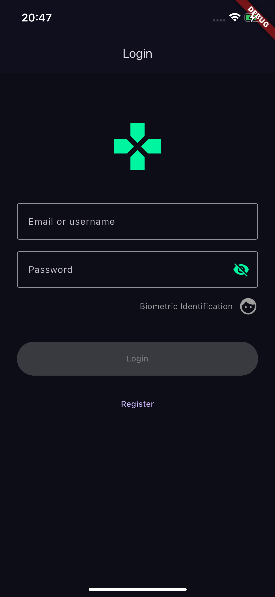
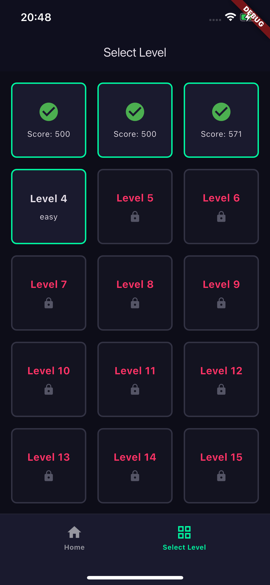
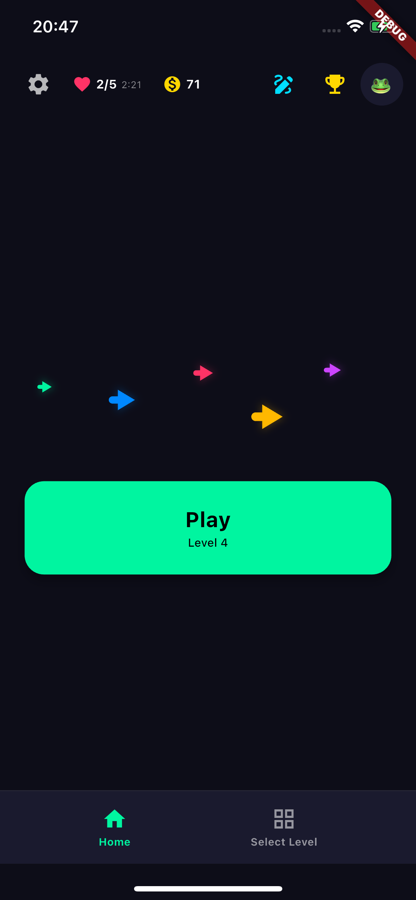
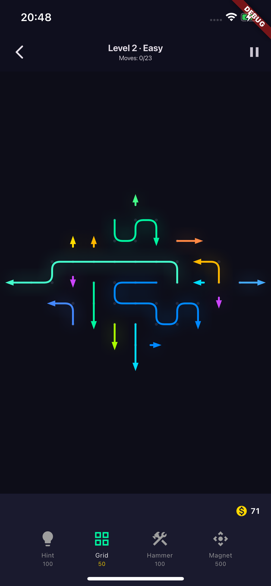

# Arrow Maze — Flutter Client 🎮

<p align="center">
  
  
  
</p>

<p align="center">
  
</p>

---

## 📖 Description

**Arrow Maze** is a Flutter clone of a SayGames-style mobile puzzle: the board is filled with multi-segment, snake-shaped arrows that the player must clear by tapping them in the right order. An arrow can only leave the board if the path from its head to the edge (or to a void cell) is completely clear of other arrows — clearing every arrow wins the level; running out of moves, running out of time (on HARD levels), or hitting a deadlock (no arrow left is clickable) loses it.

This repository is the **client only**. It needs the companion [`arrowMaze-backend`](https://github.com/ingvaleriariera/arrowMaze-backend) (NestJS + PostgreSQL) running for authentication, level distribution, leaderboards, and cross-device progress sync — the puzzle-solving logic itself (blocking graph, procedural arrow generation, win/lose rules) lives entirely on the client and never touches the network. See [Getting Started](#-getting-started) below for how to wire the two together.

| Category | Technologies |
| :--- | :--- |
| **Framework** | **Flutter** (Dart `>=3.0.0 <4.0.0`) |
| **State management** | **Riverpod** (`flutter_riverpod`) — acts as the app's dependency-injection container |
| **HTTP client** | **Dio**, wrapped by a custom `ApiClient` facade |
| **Local persistence** | **sqflite** (progress) + **SharedPreferences** (lives, custom boards, settings) |
| **Auth** | JWT issued by the backend; **local_auth** for biometric (Face ID) login |
| **Navigation** | **go_router** |
| **Audio** | **just_audio** |
| **3D rendering** | **ditredi** (optional 3D board viewport) |
| **Architecture** | 4-layer **Clean Architecture** (Domain → Application → Adapters → Infrastructure) |

---

## 📸 Demo / Screenshots

<p align="center">
  
  
  
  
</p>

<p align="center">
  <sub>Login · Home · Level select · In-game board</sub>
</p>

---

## 🏗️ Architecture

The client follows a **4-layer Clean Architecture**, with the dependency rule pointing inward — `infrastructure → adapters → application → domain`. The domain layer imports nothing from Flutter, HTTP, or SQL; it is plain, testable Dart.

```
┌──────────────────────────────────────────────────┐
│         infrastructure/  (Flutter, outermost)     │
│   Screens, CustomPainters, GoRouter, i18n,        │
│   Dio interceptors, platform services             │
├──────────────────────────────────────────────────┤
│         adapters/  (Riverpod)                     │
│   Notifiers + immutable State, Repository impls,  │
│   mappers, ApiClient                               │
├──────────────────────────────────────────────────┤
│         application/  (Use Cases)                 │
│   One class per operation, DTOs, application ports │
├──────────────────────────────────────────────────┤
│         domain/  (pure Dart, innermost)            │
│   Entities, value objects, game engine, ports      │
└──────────────────────────────────────────────────┘
```

### Directory structure

```
lib/
├── domain/          Pure Dart — entities, value objects, game rules
│   ├── entities/        Board, BoardShape, Arrow, GameSession, Level, PlayerLives...
│   ├── value_objects/   Position, Direction, ArrowColor, TimeLimit, MoveResult...
│   ├── states/          IGameState: PlayingState, PausedState, VictoryState, DefeatState
│   ├── graph/            BoardGraph (who blocks whom)
│   ├── builders/         BoardBuilder (procedural arrow generator)
│   ├── powerups/         Hint, Hammer, Magnet (domain logic)
│   └── ports/             Interfaces infrastructure must implement
├── application/     Use cases (orchestrate domain + ports) and DTOs
│   ├── usecases/          LoadLevel, ActivateArrow, Login, GetLeaderboard...
│   └── ports/              IAudioService, IAuthRepository...
├── adapters/        Riverpod: notifiers + immutable state + repos/mappers/API
│   ├── notifiers/         GameNotifier, AuthNotifier, SettingsNotifier...
│   ├── state/              GameState, AuthState...
│   ├── repositories/       Implementations of the domain/application ports
│   └── api/                 Dio-based HTTP client (ApiClient)
└── infrastructure/  Flutter-only: screens, widgets, router, i18n
    ├── screens/            GameScreen, LevelSelectScreen, LoginScreen...
    ├── widgets/            BoardPainter (CustomPainter), Board3DEngineView...
    ├── interceptors/       AuthInterceptor, LoggingInterceptor, ErrorInterceptor
    └── config/              AppRouter (go_router), AppLocalizations (en/es)
```

### The game engine — `BoardGraph`

The core of the game is a dependency graph between arrows: each arrow is a node, and a directed edge `A → B` means *"B blocks A's exit path."* An arrow is activatable exactly when its `blockedBy` set is empty (`O(1)` check); removing an arrow recalculates which arrows it was blocking. This graph — and the procedural generator that seeds it (`BoardBuilder`, backward-construction algorithm: build each arrow's body first, then verify it's currently activatable) — lives 100% on the client; the backend never validates a move.

### Level generation

The backend only ships the *shape* of a board (a JSON grid of valid/void cells). **Arrows are generated on the client** by `BoardBuilder`, seeded deterministically from `level.id.hashCode` so every player sees the same layout and leaderboard scores stay comparable, even though no arrow data ever crosses the network.

---

## 🧩 Design Patterns

The following patterns are verified directly against the source — each entry links to the real file and explains *why* it qualifies.

| Pattern | Category | Where |
| :--- | :--- | :--- |
| [Builder](#1-builder--boardbuilder) | Creational | [`lib/domain/builders/board_builder.dart`](lib/domain/builders/board_builder.dart) |
| [Factory Method](#2-factory-method--timelimitof--direction) | Creational | [`lib/domain/value_objects/time_limit.dart`](lib/domain/value_objects/time_limit.dart), [`direction.dart`](lib/domain/value_objects/direction.dart) |
| [Singleton](#3-singleton--gameprogressdatabase) | Creational | [`lib/adapters/repositories/game_progress_database.dart`](lib/adapters/repositories/game_progress_database.dart) |
| [Decorator](#4-decorator--customawarelevelrepository) | Structural | [`lib/adapters/repositories/custom_aware_level_repository.dart`](lib/adapters/repositories/custom_aware_level_repository.dart) |
| [Repository](#5-repository--ilevelrepository) | Structural | [`lib/domain/ports/i_level_repository.dart`](lib/domain/ports/i_level_repository.dart) + [`lib/adapters/repositories/level_repository_impl.dart`](lib/adapters/repositories/level_repository_impl.dart) |
| [Strategy](#6-strategy--itimelimitpolicy) | Behavioral | [`lib/domain/ports/i_time_limit_policy.dart`](lib/domain/ports/i_time_limit_policy.dart) + [`lib/domain/services/per_arrow_time_limit_policy.dart`](lib/domain/services/per_arrow_time_limit_policy.dart) |
| [State](#7-state--igamestate) | Behavioral | [`lib/domain/states/`](lib/domain/states/) |
| [Observer](#8-observer--igameobserver) | Behavioral | [`lib/domain/ports/i_game_observer.dart`](lib/domain/ports/i_game_observer.dart) + [`lib/domain/entities/game_session.dart`](lib/domain/entities/game_session.dart) + [`lib/adapters/observers/audio_observer.dart`](lib/adapters/observers/audio_observer.dart) |

### 1. Builder — `BoardBuilder`

`lib/domain/builders/board_builder.dart`

```dart
class BoardBuilder {
  late BoardShape _shape;
  late String _difficultyStr;
  late Random _random;
  final Map<String, Arrow> _arrows = {};

  static BoardBuilder create({int? seed}) => BoardBuilder(seed: seed);

  BoardBuilder setShape(BoardShape shape) {
    _shape = shape;
    _cachedBounds = null;
    return this;
  }

  BoardBuilder setDifficulty(String difficultyStr) {
    _difficultyStr = difficultyStr.toUpperCase();
    return this;
  }

  BoardBuilder addArrow(Arrow arrow) {
    _arrows[arrow.id] = arrow;
    return this;
  }

  Board build() {
    if (_arrows.isNotEmpty) return _buildWithExistingArrows();
    return _generateAndBuild();
  }
}
```

**Why this qualifies as Builder:** a `Board` is assembled step by step through chainable setters (`setShape`, `setDifficulty`, `addArrow`, each returning `this`), separating configuration from the final, validated assembly in `build()` — which additionally knows how to run the procedural generation algorithm when no arrows were supplied manually.

---

### 2. Factory Method — `TimeLimit.of` / `Direction`

`lib/domain/value_objects/time_limit.dart`

```dart
class TimeLimit {
  final int seconds;
  const TimeLimit._(this.seconds);

  static const TimeLimit none = TimeLimit._(0);

  factory TimeLimit.of(int seconds) {
    if (seconds < 0) {
      throw ArgumentError('Seconds must be non-negative');
    }
    return TimeLimit._(seconds);
  }
}
```

`lib/domain/value_objects/direction.dart`

```dart
class Direction {
  final int dx, dy, dz;
  const Direction._(this.dx, this.dy, [this.dz = 0]);

  static const Direction up = Direction._(0, -1);
  static const Direction down = Direction._(0, 1);
  static const Direction left = Direction._(-1, 0);
  static const Direction right = Direction._(1, 0);
}
```

**Why this qualifies as Factory Method:** both constructors are `private` (`TimeLimit._`, `Direction._`) — the only way to obtain an instance is through a static factory (`TimeLimit.of()`, which validates before constructing) or a pre-built static constant (`Direction.up`, etc.), so no invalid or ad-hoc instance can exist.

---

### 3. Singleton — `GameProgressDatabase`

`lib/adapters/repositories/game_progress_database.dart`

```dart
class GameProgressDatabase implements IGameProgressLocalStore {
  static final GameProgressDatabase _instance = GameProgressDatabase._internal();

  factory GameProgressDatabase() {
    return _instance;
  }

  GameProgressDatabase._internal();

  static Database? _database;

  Future<Database> get database async {
    _database ??= await _initDatabase();
    return _database!;
  }
}
```

**Why this qualifies as Singleton:** the private constructor `_internal()` prevents external instantiation; every call to `GameProgressDatabase()` returns the same `_instance`, and the underlying sqflite `Database` handle is lazily opened once (`??=`) and reused — the app never opens two connections to `arrow_maze.db`.

---

### 4. Decorator — `CustomAwareLevelRepository`

`lib/adapters/repositories/custom_aware_level_repository.dart`

```dart
class CustomAwareLevelRepository implements ILevelRepository {
  static const String customPrefix = 'custom-';

  final ILevelRepository inner;
  final IMyBoardsRepository myBoards;

  CustomAwareLevelRepository({required this.inner, required this.myBoards});

  @override
  Future<Level> getLevel(String levelId) async {
    if (!isCustomLevelId(levelId)) return inner.getLevel(levelId);

    final boardId = levelId.substring(customPrefix.length);
    final board = await myBoards.getById(boardId);
    // ...adapts the local custom board into a regular Level
  }

  @override
  Future<List<Level>> getLevels() => inner.getLevels();
}
```

**Why this qualifies as Decorator:** it wraps another `ILevelRepository` (`inner`) and implements the same interface, transparently adding behavior (resolving player-made boards by id prefix) while delegating everything else untouched — `LoadLevelUseCase` and the rest of the game pipeline never change and don't know community boards exist.

---

### 5. Repository — `ILevelRepository`

`lib/domain/ports/i_level_repository.dart` (the port defined by the domain):

```dart
abstract class ILevelRepository {
  Future<Level> getLevel(String levelId);
  Future<List<Level>> getLevels();
  Future<List<Level>> getLevelsByDifficulty(String difficulty);
}
```

`lib/adapters/repositories/level_repository_impl.dart` (the concrete implementation):

```dart
class LevelRepositoryImpl implements ILevelRepository {
  final ApiClient apiClient;
  final LevelMapper levelMapper;
  List<Level>? _levelsCache;

  @override
  Future<List<Level>> getLevels() async {
    if (_levelsCache != null) return _levelsCache!;
    final json = await apiClient.get('/api/v1/levels');
    final list = json['levels'] as List<dynamic>? ?? json as List<dynamic>;
    _levelsCache = levelMapper.fromJsonList(list);
    return _levelsCache!;
  }
}
```

**Why this qualifies as Repository:** it mediates between the domain (`Level` entities) and the data source (the backend's `GET /api/v1/levels`, plus an in-memory cache), exposing a collection-like interface so use cases never see HTTP, JSON, or Dio directly. Every data access in this codebase — levels, progress, lives, leaderboard, custom boards — follows this same port/impl split.

---

### 6. Strategy — `ITimeLimitPolicy`

`lib/domain/ports/i_time_limit_policy.dart`

```dart
abstract class ITimeLimitPolicy {
  TimeLimit forLevel({required String difficulty, required int totalArrows});
}
```

`lib/domain/services/per_arrow_time_limit_policy.dart`

```dart
class PerArrowTimeLimitPolicy implements ITimeLimitPolicy {
  static const int secondsPerArrow = 2;
  static const int minimumSeconds = 60;

  @override
  TimeLimit forLevel({required String difficulty, required int totalArrows}) {
    if (difficulty.toUpperCase() != 'HARD') return TimeLimit.none;
    final budget = totalArrows * secondsPerArrow;
    return TimeLimit.of(budget < minimumSeconds ? minimumSeconds : budget);
  }
}
```

**Why this qualifies as Strategy:** the clock rule ("only HARD levels are timed, at N seconds per generated arrow") is isolated behind `ITimeLimitPolicy`. `LoadLevelUseCase` depends only on the interface — a different policy (per-event, tuned after playtesting) could be injected without touching it.

---

### 7. State — `IGameState`

`lib/domain/states/i_game_state.dart`

```dart
abstract class IGameState {
  MoveResult handle(String arrowId, Board board);
  bool isPlaying();
  bool isOver();
  String getLabel();
}
```

Implemented by `PlayingState`, `PausedState`, `VictoryState`, and `DefeatState`. `GameSession` holds a single `IGameState _state` and delegates every move to it: `_state.handle(arrowId, board)` behaves completely differently depending on whether the session is playing, paused, already won, or already lost — without a single `if (status == ...)` branch in `GameSession` itself.

**Why this qualifies as State:** the object's behavior changes with its internal state, and each state is its own class implementing a shared interface, rather than a status flag branched on throughout the codebase.

---

### 8. Observer — `IGameObserver`

`lib/domain/ports/i_game_observer.dart` (the port — Subject notifies this):

```dart
abstract class IGameObserver {
  void onPlayerMoved(MoveResult result);
  void onScoreUpdated(int newScore);
  void onLevelCompleted(bool success, int finalScore);
}
```

`lib/domain/entities/game_session.dart` (the Subject):

```dart
class GameSession {
  final List<IGameObserver> _observers = [];

  void addObserver(IGameObserver observer) {
    if (!_observers.contains(observer)) _observers.add(observer);
  }

  void _notifyLevelCompleted(bool success) {
    for (final observer in _observers) {
      observer.onLevelCompleted(success, score);
    }
  }
}
```

`lib/adapters/observers/audio_observer.dart` (a concrete Listener):

```dart
class AudioObserver implements IGameObserver {
  final IAudioService _audioService;
  AudioObserver(this._audioService);

  @override
  void onLevelCompleted(bool success, int finalScore) async {
    await _audioService.stopMusic();
    _audioService.playEffect(success ? 'success' : 'fiasco');
  }
}
```

**Why this qualifies as Observer:** `GameSession` (Subject) knows nothing about audio — it just iterates a list of `IGameObserver` (Listener) and notifies it. `AudioObserver`, registered by `GameNotifier` in the adapters layer, reacts to victory/defeat by playing sound, keeping presentation-layer concerns (audio) completely out of the pure-Dart domain.

---

## 🧱 SOLID Principles

Each principle below is illustrated with real code from this repository.

### S — Single Responsibility Principle

Every use case does exactly one job. `lib/application/usecases/lives/lose_life_use_case.dart` only deducts a life and persists the result — it doesn't touch scores, progress, or UI state:

```dart
class LoseLifeUseCase {
  final ILivesRepository livesRepository;

  Future<PlayerLives> execute(String userId) async {
    final now = DateTime.now();
    final current = (await livesRepository.load(userId)).regenerated(now);
    final updated = current.afterLosingLife(now);
    await livesRepository.save(userId, updated);
    return updated;
  }
}
```

Every other use case (`LoadLevelUseCase`, `SubmitScoreUseCase`, `BuyLifeUseCase`...) follows the same one-class-per-operation convention in `lib/application/usecases/`.

### O — Open/Closed Principle

`ITimeLimitPolicy` (see [Strategy](#6-strategy--itimelimitpolicy)) is the extension point: a new timing rule can be added as a new class implementing the interface without modifying `LoadLevelUseCase`. The same applies to `CustomAwareLevelRepository` (see [Decorator](#4-decorator--customawarelevelrepository)) — community boards were added by wrapping the existing repository, with zero changes to `LoadLevelUseCase` or the rest of the game pipeline.

### L — Liskov Substitution Principle

`ILevelRepository` is implemented both by the real `LevelRepositoryImpl` (backed by `ApiClient`) and, in tests, by `MockLevelRepository`:

```dart
// test/application/mocks/mock_level_repository.dart
class MockLevelRepository implements ILevelRepository {
  @override
  Future<List<Level>> getLevels() async {
    return [
      Level(
        id: '550e8400-e29b-41d4-a716-446655440001',
        difficulty: 'EASY',
        boardLayout: '[[1,1,1],[1,1,1],[1,1,1]]',
        moveLimit: 10,
        timeLimit: TimeLimit.none,
      ),
      // ...MEDIUM and HARD fixtures follow the same shape
    ];
  }
}
```

Any use case that depends on `ILevelRepository` works identically whether it receives the HTTP-backed implementation or this in-memory fake — swapping one for the other requires no change in caller behavior, which is exactly what makes the domain layer testable without a real backend.

### I — Interface Segregation Principle

Repository ports are split **per concern** instead of one monolithic data-access interface — `ILivesRepository` (2 methods) and `IGameProgressRepository` (3 methods) share no methods, so neither consumer depends on operations it doesn't use:

```dart
// lib/domain/ports/i_lives_repository.dart
abstract class ILivesRepository {
  Future<PlayerLives> load(String userId);
  Future<void> save(String userId, PlayerLives lives);
}

// lib/domain/ports/i_game_progress_repository.dart
abstract class IGameProgressRepository {
  Future<void> save(GameProgress progress);
  Future<GameProgress?> get(String userId);
  Future<GameProgress> sync(String userId);
}
```

### D — Dependency Inversion Principle

Use cases and notifiers depend on port abstractions, never on concrete adapters. Riverpod's `providers.dart` is where the concrete binding happens — the provider is *typed with the interface*, not the implementation:

```dart
// lib/adapters/providers.dart
final livesRepositoryProvider =
    Provider<ILivesRepository>((ref) => LivesRepositoryImpl());

final loseLifeUseCaseProvider = Provider((ref) => LoseLifeUseCase(
  livesRepository: ref.watch(livesRepositoryProvider),
));
```

`LoseLifeUseCase` only ever sees `ILivesRepository` — swapping `LivesRepositoryImpl` for another implementation means changing one line in `providers.dart`, nothing in the use case.

---

## 🎯 AOP (Aspect-Oriented Programming)

Cross-cutting HTTP concerns are isolated from business logic as **Dio `Interceptor`s** in `lib/infrastructure/interceptors/`, registered once on `ApiClient` in `lib/infrastructure/config/my_app.dart` — no use case, repository, or screen needs to know about them:

```dart
// lib/infrastructure/config/my_app.dart
apiClient.addInterceptor(AuthInterceptor(authRepository: authRepository));
apiClient.addInterceptor(LoggingInterceptor());
apiClient.addInterceptor(ErrorInterceptor());
```

- **`AuthInterceptor`** — injects the `Bearer` token into every outgoing request and forces logout on a `401` response.
- **`LoggingInterceptor`** — logs every request/response/error in debug builds only (`kDebugMode`), with zero production overhead.
- **`ErrorInterceptor`** — normalizes every `DioException` into a typed domain exception (`BadRequestException`, `UnauthorizedException`, `NotFoundException`, `ServerException`, `NetworkException`) so the rest of the app never branches on HTTP status codes.

**Strategy behind these aspects:** Dio's interceptor chain plays the role of an AOP weaver — each interceptor has a single cross-cutting responsibility (SRP) and is composed onto `ApiClient` from the outside (OCP) instead of being copy-pasted into every repository method. This mirrors the same two principles the backend applies with its own global `LoggingInterceptor`/`HttpExceptionFilter` (NestJS `APP_INTERCEPTOR`/`APP_FILTER`) — logging and error handling as aspects, not business logic.

---

## 🚀 Getting Started

### Prerequisites

- [Flutter SDK](https://docs.flutter.dev/get-started/install), stable channel (this project targets Dart `>=3.0.0 <4.0.0`)
- The [`arrowMaze-backend`](https://github.com/ingvaleriariera/arrowMaze-backend) running — see that repo's README for setup. This client has no offline/demo mode; login, level lists, and leaderboards all require it.

### 1. Install dependencies

```bash
flutter pub get
```

### 2. Point the client at your backend

The API base URL is **never hardcoded** — it's read at build time from a gitignored `local.env.json` so teammates don't overwrite each other's local IPs:

```bash
cp local.env.json.example local.env.json
```

Edit `local.env.json` with your backend's reachable address:

```json
{ "API_BASE_URL": "http://YOUR_LOCAL_IP:3000" }
```

Without this file, the app falls back to `http://localhost:3000` (works for web and the iOS simulator, not for Android emulators/physical devices — see below).

### 3. Run it

```bash
flutter run --dart-define-from-file=local.env.json
```

#### Web

Works out of the box in Chrome (`flutter run -d chrome --dart-define-from-file=local.env.json`) against `localhost`.

#### Android

- **Emulator:** `localhost` doesn't reach the host machine — use `http://10.0.2.2:3000` as `API_BASE_URL`.
- **Physical device:** needs your machine's real LAN IP (`ipconfig getifaddr en0` on macOS) — neither `localhost` nor `10.0.2.2` work. Full troubleshooting (ADB setup, firewall, backend listening on `0.0.0.0`) is in [`RUN_ANDROID.md`](RUN_ANDROID.md).
- Check `android/app/src/main/AndroidManifest.xml` has the `INTERNET` permission if testing against a remote backend.

#### iOS

```bash
cd ios && pod install && cd ..
flutter run --dart-define-from-file=local.env.json
```

- Simulator: `localhost` resolves to the host, no IP change needed.
- Physical device: needs your machine's LAN IP plus an Apple Developer signing team in Xcode. See [`RUN_iOS.md`](RUN_iOS.md).

---

## 🧪 Running Tests

```bash
flutter test
```

To check static analysis on the production code only:

```bash
flutter analyze lib
```

> [!NOTE]
> **Known test debt (preexisting, not introduced by this documentation update):** several suites currently fail to compile or run. `test/adapters/notifiers_test.dart` and `test/adapters/repositories_test.dart` reference mocks that drifted out of sync with current constructors. Most failures in `test/domain/` (`blocking_and_activation_test.dart`, `game_session_test.dart`, `entities_test.dart`, `powerups_test.dart`, `validators_test.dart`, `board_builder_ring_shape_test.dart`) build `BoardShape` from bare 2D-array fixtures (`[[1,1,1]...]`) instead of the `{"grid": [...]}` wrapper `BoardShape.fromJson` now expects to match the real backend payload; a smaller number are stale assertions against an old convention (e.g. `entities_test.dart` still expects `Arrow.getHead()` to return `segments.first`, but the implementation has used `segments.last` for a while). None of this reflects a regression in shipped game logic — it's outdated test fixtures/expectations.

---

## 🤖 AI Usage Documentation

This project was developed with significant AI assistance, documented transparently as required by the course (Section 7). See **[AI_USAGE.md](AI_USAGE.md)** for the full record: tools and models used, per-task usage log, approximate percentage of AI-assisted code, cases where the AI produced incorrect results and how they were detected and corrected, and the team's reflection on productivity and code quality.

---

## 🤝 Contributing

### Commit Convention

This repository follows **[Conventional Commits](https://www.conventionalcommits.org/)**, written in English: `type(scope): description`, e.g.:

```
feat(client): add community custom boards editor
fix(client): stop void re-entry arrows from double-firing their exit animation
style(client): tighten 3D arrow corners to rounded-rectangle shape
docs(client): update CLAUDE.md with new features and design principles
```

Common types: `feat`, `fix`, `chore`, `docs`, `test`, `refactor`, `style`.

### Branching & Workflow

- **`main`** — stable, deployable branch.
- **`develop`** — integration branch; feature and fix branches merge here first.

Workflow: branch off `develop`, commit using the convention above, then open a pull request back into `develop`. `develop` is merged into `main` for releases.

### Pull Requests

- Keep PRs scoped to a single feature or fix.
- Ensure `flutter analyze lib` and `flutter test` pass (or note pre-existing failures explicitly) before requesting review.
- Describe *why* the change is needed — the diff already shows what changed.
